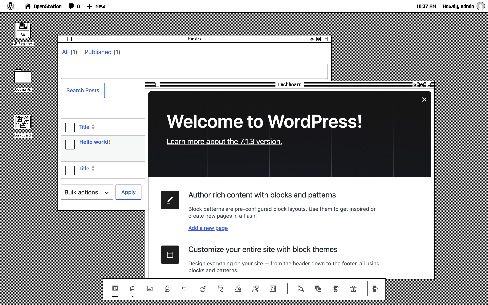

# Retro 84

A desktop theme for [OpenStation](https://github.com/WordPress/openstation) that turns WordPress into the first desktop most people ever saw: one bit per pixel, a dithered grey desk, striped title bars with a close box, and type drawn on a grid.



## Install

Needs an OpenStation version newer than 1.1.12.

1. Download this repository as a ZIP: **Code > Download ZIP**.
2. In WordPress, open OpenStation and go to **Preferences > Themes**.
3. Drop the ZIP on the upload box.
4. Pick **Retro 84**, then click **Apply Retro 84's recommended layout and effects**. That puts the dithered desk in place, shows the WordPress toolbar as a menu bar with the time, and clears Mio and the widgets off the desk.

## What's in it

- `theme.json`: the manifest, with the tokens, icons, textures, fonts, wallpaper and recommended settings.
- `chrome/`: title-bar stripes, the close box and the window glyphs.
- `icons/`: the icon set.
- `fonts/`: OS Retro Chicago (drawn for 12px) and OS Retro Geneva (drawn for 9px), two bitmap faces.
- `src/`: the scripts that generate all of the above. The download ZIP leaves them out.

## Rebuild

Everything outside `src/` except `preview.svg` is generated. Edit the sources, then run the matching script from the repo root with Node 24:

```bash
node src/build-theme.mjs     # theme.json, from theme.mjs and icon-map.mjs
node src/build-chrome.mjs    # chrome/
node src/build-icons.mjs     # icons/, from icons.txt
node src/build-fonts.mjs     # fonts/, from retro-chicago.txt and retro-geneva.txt
```

`src/icon-sheet.html` and `src/font-specimen.html` show the icons and the fonts at a glance.

## License

GPL-2.0-or-later, see `LICENSE.txt`. The fonts are under the SIL Open Font License 1.1, see `fonts/OFL.txt`.
